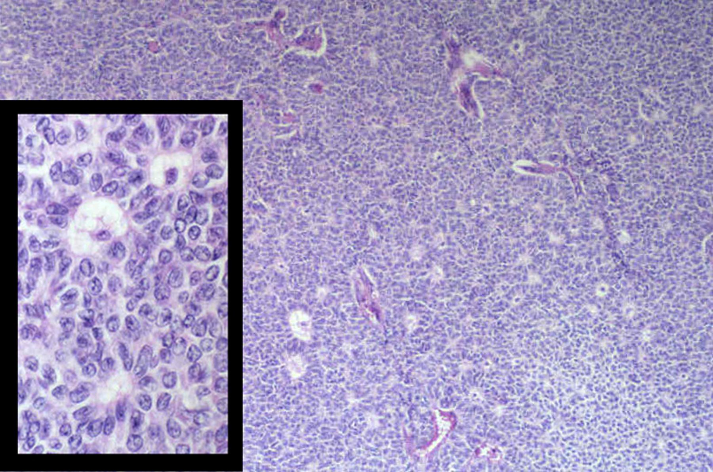
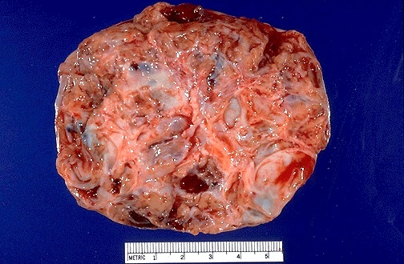

## Background

1. Granulosa cell tumors are a subtype of ovarian sex cord-stromal tumors. 
2. Granulosa cells are responsible for the production of of estradiol from androgens
   under the control of FSH.
3. Tumor comes in two variants, <b>juvenile</b> and <b>adult</b>, which are distinguished
   histologically.
4. Due to the estrogen effects, there is an association between OGCT and endometrial cancer.

--- .class #id 

## Epidemiology

- Sex cord–stromal tumors are less common than both epithelial and germ cell tumors.
- Granulosa cell tumors account for 2% of ovarian tumors in women [1]
- 95% of cases are of the adult type
- 5-year survival rate from the first recurrence is 55%

[11]

---

## Genetics

- Caused by <b>C134W</b> mutation in FOXL2 [3]
- FOXL2 is a transcription factor essential for development of female appearance
  and the differentiation of granulosa cell tumors.
- Tumorgenesis is suspected to be through deregulation of the <b>TGF-β</b> pathway
- Exact mechanism by which the mutation causes disease is unknown.
- Structure of FOXL2 protein is unknown. 

[4]

---

## Presentation

- Tumors are often detected early due to <b>hyperestrogenism</b>.
- May manifest as irregular bleeding, breast or uterus enlargement, breast tenderness,
  amenorrhea, or precocious puberty. [2]
- Mass effects like abdominal enlargement may be present
- May occur with endometrial cancer in postmenopausal women.
- "Palpable mass can be found in 85-97% of patients" [1]

 [8]

---

## Diagnosis

- Definitive diagnosis is made by histology after surgical excision via laparotomy.
- Diagnosis should be suspected in large ovarian masses with signs of hyperestrogenism.
- <b>Inhibin</b> is a marker for OGCT, (also mucinous epithelial ovarian carcinomas) but it is non-specific. Used to monitor recurrence. 
- <b>Estradiol</b> has a sensitivity of approximately 70%.[1]
- <b>Müllerian inhibiting substance</b> is highly specific for OGCT (may not be available)
- <b>FOXL2</b> gene testing may be an option in the future and would likely be highly sensitive and specific.

---

## Staging

- Staged according to FIGO guidelines 

1. T1	I	Tumor confined to ovaries or fallopian tubes
2. Tumor involves one or both ovaries or fallopian tubes with pelvic extension (below pelvic brim) or peritoneal cancer
3. Tumor involves one or both ovaries or fallopian tubes, or peritoneal cancer, with cytologically or histologically confirmed spread to the peritoneum outside the pelvis and/or metastasis to the retroperitoneal lymph nodes. 

- Most tumors are caught in stage 1A due to the hormonal signs, and can be resected surgically. Long term disease-free survival rates are 90% in this case. [2]

---

## Surgical Therapy 

- For women without intent to have future children TAH/BSO is the recommended therapy.
- For women who wish to preserve fertility, unilateral oorphectomy is an option if the contralateral ovary appears normal to inspection/biopsy. Unilateral excision has an equivalent cure rate in early stages 

- For pregnant women "Optimal time for abdominal exploration is approximately 16-18 weeks of gestation" 
- If tumor has spread outside the ovary "Total abdominal hysterectomy and bilateral
   salpingo-oophorectomy, with removal of the fetus and placenta in toto" should be considered [1]

- For most patients unilateral salpingo-oophorectomy is the best option. [5]

---

## Special Considerations in Surgery

- <b>Patterns of metastasis in sex cord-stromal tumors of the ovary: can routine staging lymphadenectomy be omitted?</b>
- Yes, but only if diagnosis is known at time of surgery 
- "Of the 58 patients who had lymph nodes sampled during the primary surgery, none had positive nodes." [10]

---

## Pharmacologic Therapy

- Not clear when to use adjuvant therapy, recommendations vary widely with some treating all stages with chemo and others only treating recurrence after surgery. General lack of evidence in this area.
- Some studies suggests that juvenile tumors should be treated with cisplatin based chemotherapy. [6] <b> Ovarian sex cord-stromal tumors in children and adolescents.
 Clin Oncol. 2003 </b>
 - NCCN recommends treating stage II to IV [2]
- The current regimen for OGCT is bleomycin, etoposide, and cisplatin [5]

---

## Anti-Angiogenesis 

- <b>Anti-angiogenesis therapy with bevacizumab for patients with ovarian granulosa cell tumors.</b> [7]
- Response rate: 38%
- Clinical benefit rate: 63%

- <b>Efficacy and safety of bevacizumab in recurrent sex cord-stromal ovarian tumors: results of a phase 2 trial of the Gynecologic Oncology Group.</b>
- Partial response: 16.7%
- Stable disease: 77.8%  
- Progressive disease: 5.6%

---

## Radiotherapy 

- The evidence for RT in OGCT is weak.
- There is no consensus on postoperative radiotherapy,

---

## Conclusion

- OGCT is a rare neoplasm with a generally good prognosis due to its early signs and hormonal effects.
- Two variants: juvenile and adult with minor differences in management
- Management is primarily surgical
- Future screening may be improved through FOXL2 assays
- Potential for research into the pathogenesis with interesting connections to embryologic development of sexual dimorphism.

---

## References

1. http://emedicine.medscape.com/article/254489-overview
2. https://www.uptodate.com/contents/sex-cord-stromal-tumors-of-the-ovary-granulosa-stromal-cell-tumors?source=search_result&search=granulosa%20cell%20tymor&selectedTitle=1~150#H10
3. https://www.ncbi.nlm.nih.gov/pubmed/28594898
4. https://www.rcsb.org/pdb/explore/explore.do?structureId=2A07
5. https://www.ncbi.nlm.nih.gov/pubmed?term=7530680
6. https://www.ncbi.nlm.nih.gov/pubmed?term=12805338
7. https://www.ncbi.nlm.nih.gov/pubmed?term=19524286
8. http://library.med.utah.edu/WebPath/FEMHTML/FEM057.html
9. https://www.bowelcanceraustralia.org/images/Treatment_Avastin_770v1.jpg
10. https://www.ncbi.nlm.nih.gov/pubmed?term=19162310
11. http://www.dartmouth.edu/~anatomy/Histo/lab_6/female/DMS173/06.gif